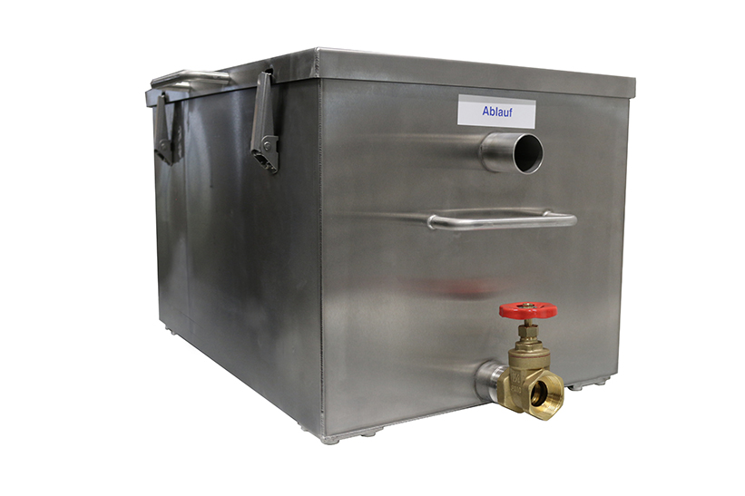
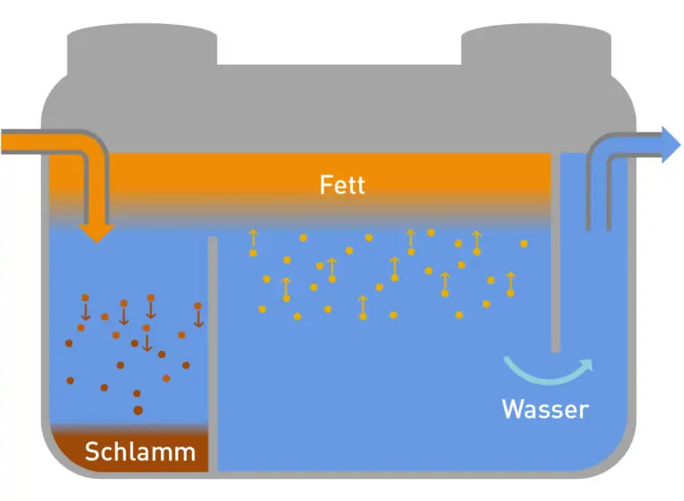

# Fettabscheider
Der Fettabscheider filtert Fett- und Ölreste aus unserem Abwasser, bevor es in die Kanalisation geleitet wird.

## Ablassen und Reinigen
Öle und Fette sammeln sich oben an der Wasseroberfläche. Durch Aufdrehen des Ablaufs am Boden des Fettabscheiders (das rote Rädchen) kann das vom Öl getrennte Wasser abgelassen werden (alternativ kann man es auch abpumpen). Das Wasser kann einfach in die Kanalisation gelassen werden.

Beobachtet den Ablauf. Irgendwann wird die Ölschicht erreicht. Ab dann sollte der Ablauf nicht mehr in die Kanalisation fließen, sondern in ein vorbereitetes Gefäß (z.B. ein leeres Ölfass)

Wenn die Wanne dann komplett leer ist, muss der Fettabscheider gereinigt werden. Das geht am einfachsten, durch Absprühen mit dem Hochdruckreiniger ("kärchern").

## Entsorgung

❗️Speiseöl auf keinen Fall in den Ausguss oder in die Toilette schütten!

Bei uns übliche Mengen (~10L) können über den Restmüll entsorgt werden (in Flaschen o.ä.).