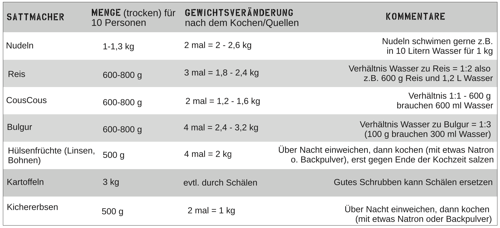

# Mengenkalkulation

>Menschen, die den ganzen Tag draussen waren und / oder sich körperlich anstrengen, essen mehr als Leute, die den ganzen Tag auf einem Kongress rumsitzen.

## Strategien

### Tellerstrategie

Ein Teller Essen sollte am Schluss ~500 Gramm wiegen (Endgewicht). Das entspricht einem ungefähren Volumen von 0,5L.
Beim Nudelbeispiel von oben würde das so aussehen: 125 Gramm trockene Nudeln ergeben nach dem Kochen, wenn sie mit Wasser vollgesogen sind, ein Endgewicht von ca 250 Gramm.
Jetzt brauchts noch Soße: So eine schöne Kelle, wiegt vielleicht so um die 250 Gramm. Also ergäbe das insgesamt 500 Gramm/ Person. Bei so einer Menge könnt ihr locker davon ausgehen, dass das Essen halbwegs satt machen wird.

### Topfansatz
>
> Der dritte mögliche Ansatz ist der Topfansatz, sozusagen der Teller- ansatz auf den Topf hochgerechnet.
Nehmen wir an, ihr wollt Suppe für 50 Leute machen, pro Teller (siehe Telleransatz) also maximal 0,5 Kilo Suppe. 0,5 Kilo x 50 ergeben 25 Li- ter Suppe am Ende. Dadurch lässt sich Folgendes ableiten: Der Topf sollte ca. 30 Liter fassen, damit auch noch umgerührt werden kann.

### Beispiele

100L Suppe - 200 Portionen
1000 Personen: 125kg trockene nudeln

Siehe auch:

* <https://we.riseup.net/food4action/calculate-everything-mass-calculation>

## Mengenveränderungen

Beim Kochen verändert sich das Gewicht der Lebensmittel. Es ist wichtig, zu wissen, wie viel die jeweiligen Rohstoffe trocken und dann gekocht wiegen.

