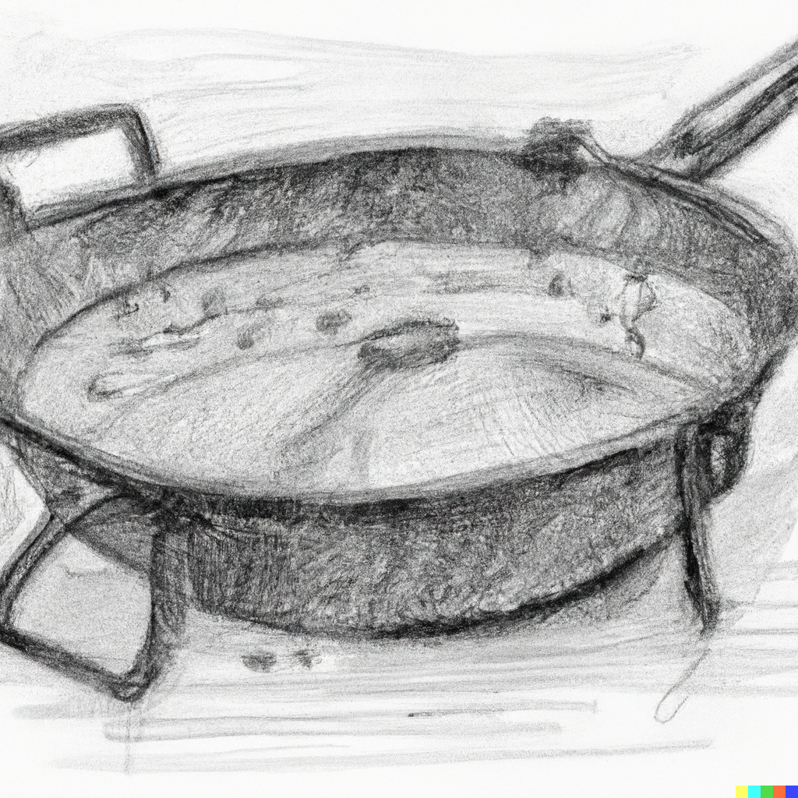

# Paella Brenner

<!--  -->

### Paella Brenner besonderheiten

Der Paella Brenner bietet ein paar Besonderheiten die beachtet werden wollen. Der Brenner hat mehrere Ringe, welche seperate Gas zufuhr haben und daher seperat gezündet werden müssen. Bei den Paella Brennern ist allerdings, nicht wie bei den meisten anderen Brenner Modellen, keine termische Sicherung verbaut die verhindert, dass falls die Flamme aus geht, der gasfluss gestoppt wird. Desshalb sollte besonders darauf geachtet werden, dass die Durchflussregler zu sind wenn der Ring oder der Brenner an sich nicht verwendet wird. Daher sollte der Brenner auch nicht dadurch ausgemacht werden indem irgendwo anders als an den Reglern die Gaszufuhr unterbrochen wird wie beispielsweise also direkt an der Gasflasche.
Der Brenner hat ein dreibeiniges Gestell. Dadurch sollte es gut möglich sein, wenn ein fester Untergrund gegebne ist, durch drehen die Pfanne Gerade aufzustellen.

<!-- Bild von Brenner mit 3 Ringen, Draufsicht -->

### Anmachen des Brenners

* Die Pfanne sollte vor dem anzünden auf dem Brenner liegen, da sonst wegen der Hitze dabei schwierigkeiten entstehen könntn, besonders wenn alleine gearbeitet wird.
* Die Ringe sind von unten sehr gut erreichbar. Es bietet sich an die Ringe von innen nach außen anzuzünden.
* Falls ein nicht geeigneter Druckminderer Verwendet wurde, kann es sein, dass der Gasdurchfluss nicht für alle Ringe reicht. Für die allermeißten anwendungen sollten allerdings auch die zwei inneren Ringe des Brenners ausreichen.

### Reinigen der Pfanne

Da die Pfanne aus nicht rostfreiem Stahl besteht sollten einige dinge beim Saubermachen beachtet werden. Sie sollte nicht mit agressivem Reinigungsmitteln behandelt werden. Abspühlen mit Wasser und evtl. leichtem Spühlmittel sollte meist ausreichen. Vorher kann bei bedarf die Pfanne mit Küchentüchern von groben Fettresten befreit werden. Nach dem Spühlen sollte die Pfanne abgetrocknet werden, da besonders die Unterseite rostet.
