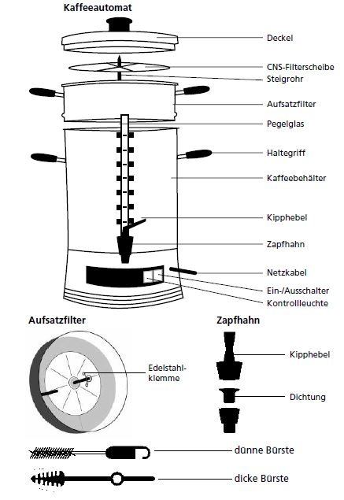

# How-to make coffee ☕️

Größere Mengen Kaffee kannst du entweder mit einem Jutebeutel oder mit einer Rundfilterkaffeemaschine kochen. Pro Liter fertigen Kaffee brauchst du etwa 30g gemahlenes Pulver.

## Die Jutebeutelmethode

Zum Aufbrühen einen sauberen Jutebeutel in einen Behälter (am besten ein Thermobehälter mit Zapfhahn) einhängen,  Kaffeepulver in den Beutel geben und kochendes Wasser durch den noch offenen Beutel gießen.

ℹ️ Den Beutel nicht zuknoten. Wenn du das machst geht die Luft nicht raus, der Beutel schwimmt oben, der Kaffe verklumpt und nur die äußerste Seite vom Kaffeklumpen hat Kontakt mit dem Wasser.

Nach circa zehn Minuten den Beutel mit Satz herausnehmen und aufhängen. Wenn es schön abgetropft ist, lässt sich der Satz besser aus dem Beutel kippen.

## Mit der Rundfilterkaffeemaschine

1. Den Wasserbehälter mindestens zur Hälfte befüllen.
2. Den Filteraufsatz einsetzen.
3. Jetzt kommt gemahlener Kaffee in den Filter.
4. Anschalten.

todo: Wie viel liter haben unsere Kaffeemaschinen?
