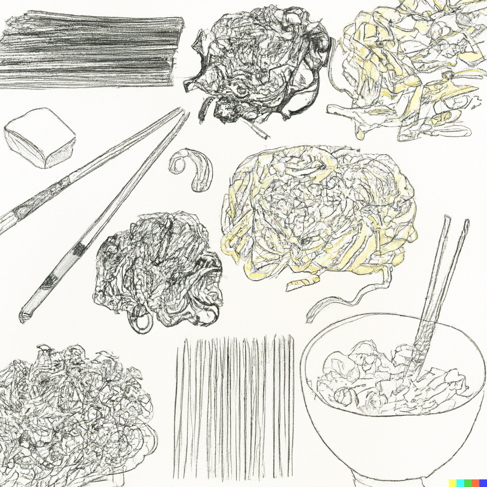

# Nudeln kochen für > 100 Personen

Gesalzenes Wasser in mehreren 100L Töpfen kochen. Sollte wie Meerwasser schmecken (bei 100L etwa 10 Salatkellen).

In 5 min abstand nudeln rein, sodass nicht alle gleichzeitig fertig werden. Während die ersten dann rausgeholt werden, garen die nächsten fertig. 

Nudeln nicht abgießen sondern mit Sieben in GNs umfüllen und im verbliebenen Wasser die nächste Fuhre kochen.

Früh anfangen. 100l Wasser zu kochen kann mehr als 30 min dauern.

## Wie viele Nudeln?

Siehe [Mengenkalkulation](/wiki/Mengenkalkulation).